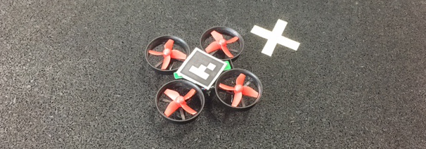

# drone-tracking
Control an EACHINE E010 drone from a computer using Python, a webcam and an ArUco marker.

Using work from [@goebish](https://github.com/goebish/nrf24_multipro) (transmitter protocol) and [@perrytsao](https://github.com/perrytsao/nrf24_cx10_pc) (input through serial port).

## Hardware Setup
- EACHINE E010 drone (about [$15](http://www.banggood.com/Eachine-E010-Mini-2_4G-4CH-6-Axis-Headless-Mode-RC-Quadcopter-RTF-p-1066972.html))
- Arduino Uno (about [$18](https://www.amazon.com/Arduino-Uno-R3-Microcontroller-A000066/dp/B008GRTSV6))
- 2.4GHz nRF24L01+ Wireless Card (about [$1.7](https://www.amazon.com/gp/product/B015PREUOE/) each)
- Socket adapter with on-board 3.3V regulator (about [$1.3](https://www.amazon.com/gp/product/B01M61530E/) each)
- A few male to female jumper wires ([here](https://www.amazon.com/gp/product/B00PBZMN7C/) for instance)
- A webcam with a low latency
- A printer
- Double-sided tape

## Software Setup
- Python 3.6
- OpenCV 3.2.0 with [opencv_contrib](https://github.com/opencv/opencv_contrib) installed

## How-To

1. Connect the nRF24L01+ to the Arduino Uno using [perrystao's tutorial](https://github.com/perrytsao/nrf24_cx10_pc/blob/master/README.md).
2. Upload **nrF24_multipro/nRF24_multipro.ino** to your Arduino Uno. You have to modify it if your drone is not an E010 drone.
3. Calibrate your camera using for instance the [calibrate.py](https://github.com/opencv/opencv/blob/master/samples/python/calibrate.py) example in the OpenCV sources. Don't forget to specify the size of your chessboard and the size of the squares in the unit you want to use.
4. Print a board of ArUco markers that fit on your drone. I used [this one](images/board.jpg) for the E010 drone.
5. Stick the marker to your drone.
6. Put the drone where you want the origin of your world coordinates to be, in the right orientation.
7. In **define_origin.py**: specify the camera channel, the location of your calibration parameters and the size of your marker.
8. Run **define_origin.py**, and press the space bar when the origin marker is detected.
9. In **threadedFly.py**: specify the ID of the ArUco marker that you put on the drone, its size, the camera channel, the port your Arduino Uno is plugged to, the location of your calibration parameters, the location of your origin.npz file.
10. Run **threadedFly.py**.
11. Tune the PID controller gains to make your drone fly as you please.
12. Design your own controller, trajectories, etc. Have fun!

